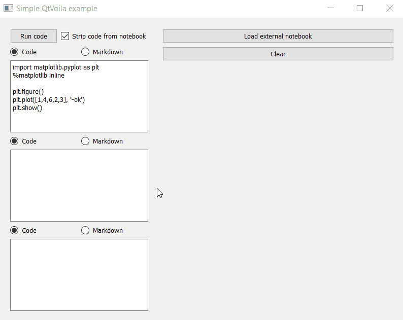
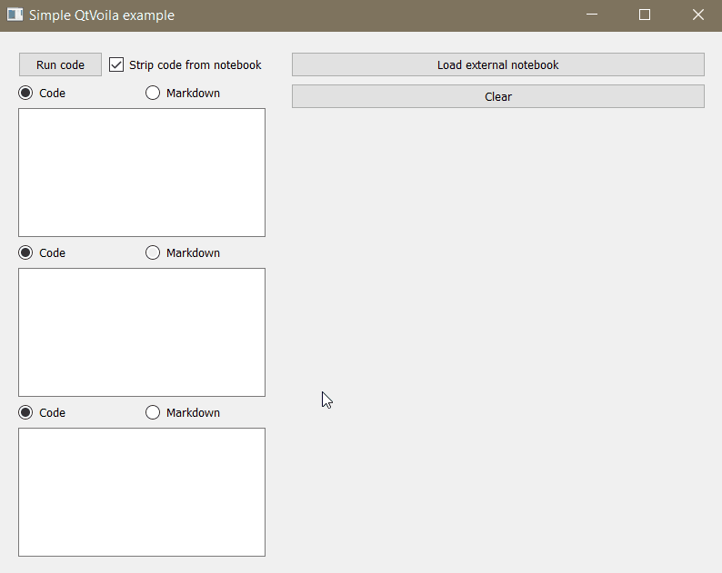

# QtVoila

[](https://badge.fury.io/py/qtvoila)

A [Qt for Python](https://wiki.qt.io/Qt_for_Python) extension for [Voila](https://github.com/voila-dashboards/voila)!

**QtVoila** a Qt for Python (Pyside2) widget that controls and renders a Voila application. It's a convenient way of embedding the awesomeness of Voila in your Qt applications.

The idea of the widget and implementation details are described in this [blog post](https://luiztauffer.github.io/guacamole-data-science/posts/2020-04-20-qtvoila/).

## Installation

```
$ pip install qtvoila
```

## Usage

QtVoila should be imported and used as a PySide2 widget, anywhere inside your GUI application. Although it can be initialized with default parameters, you are able to define the **parent** (the PySide2 application), the **temporary directory** where any created notebooks will be temporarily stored, the path to an existing **external notebook** and the boolean option to either strip code sources on Voila rendering or not:

```python
from qtvoila import QtVoila

voila_widget = QtVoila(
    parent=None,
    temp_dir=None,
    external_notebook=None,
    strip_sources=True
)
```

If creating a notebook programmatically, new cells can be added with the method `add_notebook_cell()`. This method accepts three arguments: `code_imports` is a dictionary of modules to be imported, `code` is the string containing the cell's code or markdown text and `cell_type` defines if the cell is of type code or markdown. Examples:

```python
# Mardown cell
mtext = "#This is my title\n"
mtext += "Here goes some text. Check out this graphic:"
voila_widget.add_notebook_cell(code=mtext, cell_type='markdown')

# Code cell
imports = {
  'matplotlib': ['pyplot'],
  'numpy': [],
}
code = "%matplotlib inline\n"
code += "pyplot.plot(numpy.random.rand(10))"
voila_widget.add_notebook_cell(code_imports=imports, code=code, cell_type='code')
```

To run the Voila process and render the result on widget:
```python
voila_widget.run_voila()
```

To clear widget and stop the background Voila process:
```python
voila_widget.close_renderer()
```

## Examples

[Here](https://github.com/luiztauffer/qtvoila/tree/master/examples) you can find some examples on how to use QtVoila in your PySide2 application. For example, creating notebooks from user's input and rendering them:



To have your GUI importing existing notebooks and rendering them:


