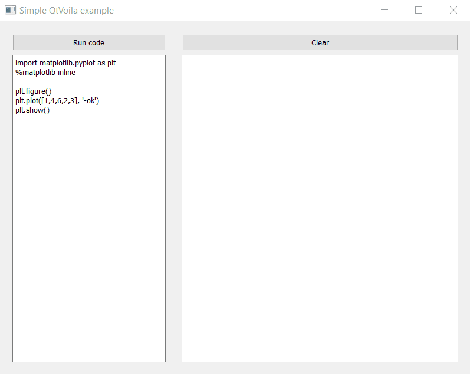

# QtVoila

A Qt for Python extension for Voila!

## Introduction

This is a Qt for Python ([Pyside2](https://wiki.qt.io/Qt_for_Python)) widget encapsulating a [Voila](https://github.com/voila-dashboards/voila) application. It's a convenient way of embedding the awesomeness of Voila in your Qt applications.

## Installation

```
$ pip install git+https://github.com/luiztauffer/qtvoila.git
```

## Usage

QtVoila should be imported and used as a PySide2 widget:

```python
from qtvoila import QtVoila

voila_widget = QtVoila()
```

To pass the Python code to be processed by Jupyter:
```python
code = "here goes your python code"
voila_widget.code = code
```

To run the Voila process and render the result on widget:
```python
voila_widget.run_voila()
```

To clear widget and stop the background Voila process:
```python
voila_widget.close_renderer()
```

## Examples

Find the code for the example below at [examples](https://github.com/luiztauffer/qtvoila/tree/master/examples):


